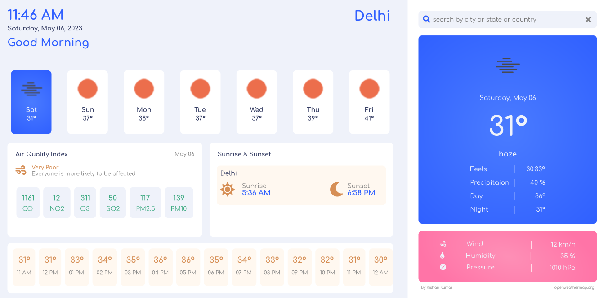

# Weather Forecast Web Application

## Overview

This is a web application that provides weather forecasts for both the current location and any searched location. It's built using React and utilizes data from the OpenWeatherMap API. With this application, users can quickly access weather information, helping them plan their activities accordingly.

## Features

- **Current Weather**: View the current weather conditions for your location.

- **Search for Weather**: Search for weather information in any location by entering the city name or coordinates.

- **5-Day Forecast**: Get a 5-day weather forecast to help you plan for the week.

## Technologies Used

- **React**: This web application is built using the React library.

- **OpenWeatherMap API**: Weather data is fetched from the OpenWeatherMap API.

- **CSS**: Styling is done using CSS for a clean and responsive design.

## Live Site
[View live](https://kishan-kr.github.io/weather-forecast/)

## Acknowledgements

- Thanks to OpenWeatherMap for providing the weather data and API.

- Special thanks to the React community for building such a powerful and flexible library.

